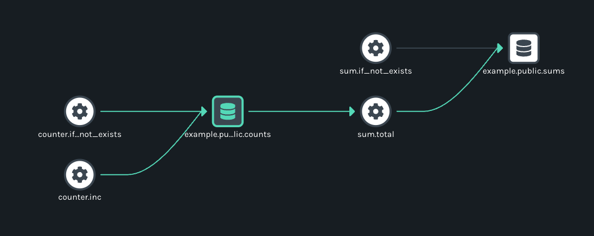
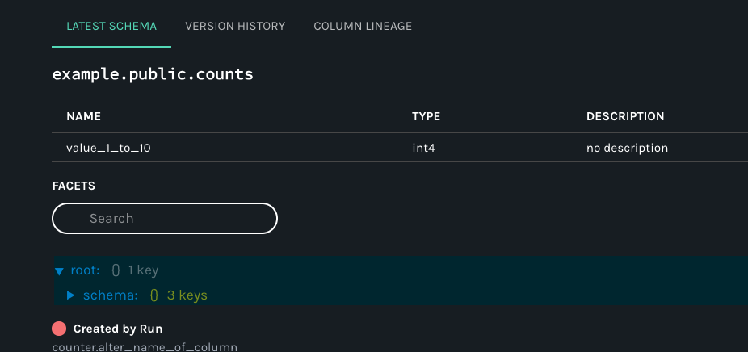

# Getting Started with Airflow and OpenLineage+Marquez

In this example, we'll walk you through how to enable Airflow DAGs to send lineage metadata to [Marquez](https://marquezproject.ai/) using OpenLineage. 

### You’ll Learn How To:

* configure Airflow to send OpenLineage events to Marquez
* write OpenLineage-enabled DAGs
* troubleshoot a failing DAG using Marquez

## Prerequisites

Before you begin, make sure you have installed:

* [Docker 17.05](https://docs.docker.com/install)+
* [Astro CLI](https://docs.astronomer.io/astro/cli/overview)
* [Subversion](https://subversion.apache.org/)

> **Note:** We recommend that you have allocated at least **2 CPUs** and **8 GB** of memory to Docker.

## Step 1: Configure Your Astro Project

Use the Astro CLI to create and run an Airflow project locally that will integrate with Marquez.

1. In your project directory, create a new Astro project:

    ```sh
    $ ..
    $ mkdir astro-marquez-tutorial && cd astro-marquez-tutorial
    $ astro dev init
    ```

2. Using Subversion, download some scripts required by Marquez services:

    ```sh
    svn checkout https://github.com/MarquezProject/marquez/trunk/docker
    ```

    After executing the above, your project directory should look like this:

    ```sh
    $ ls -a
    .                     Dockerfile            packages.txt
    ..                    README.md             plugins
    .astro                airflow_settings.yaml requirements.txt
    .dockerignore         dags                  tests
    .env                  docker
    .gitignore            include
    ```

3. To configure Astro to send lineage metadata to Marquez, add the following environment variables below to your Astro project's `.env` file:

    ```bash
    OPENLINEAGE_URL=http://host.docker.internal:5000
    OPENLINEAGE_NAMESPACE=example
    AIRFLOW__LINEAGE__BACKEND=openlineage.lineage_backend.OpenLineageBackend
    ```

    These variables allow Airflow to connect with the OpenLineage API and send events to Marquez.

3. It is a good idea to have Airflow use a different port for Postgres than the default 5432, so run the following command to use port 5678 instead:

    ```sh
    astro config set postgres.port 5678
    ```

## Step 3: Add Marquez Services using Docker Compose

Astro supports manual configuration of services via Docker Compose using YAML.

Create new file `docker-compose.override.yml` in your project and copy/paste the following into the file:

```yml
version: "3.1"
services:
  web:
    image: marquezproject/marquez-web:latest
    container_name: marquez-web
    environment:
      - MARQUEZ_HOST=api
      - MARQUEZ_PORT=5000
    ports:
      - "3000:3000"
    depends_on:
      - api

  db:
    image: postgres:12.1
    container_name: marquez-db
    ports:
      - "6543:6543"
    environment:
      - POSTGRES_USER=postgres
      - POSTGRES_PASSWORD=password
      - MARQUEZ_DB=marquez
      - MARQUEZ_USER=marquez
      - MARQUEZ_PASSWORD=marquez
    volumes:
      - ./docker/init-db.sh:/docker-entrypoint-initdb.d/init-db.sh
    command: ["postgres", "-c", "log_statement=all"]
  
  api:
    image: marquezproject/marquez:latest
    container_name: marquez-api
    environment:
      - MARQUEZ_PORT=5000
      - MARQUEZ_ADMIN_PORT=5001
    ports:
      - "5000:5000"
      - "5001:5001"
    volumes:
       - ./docker/wait-for-it.sh:/usr/src/app/wait-for-it.sh
    links:
      - "db:postgres"
    depends_on:
      - db
    entrypoint: ["/bin/bash", "./wait-for-it.sh", "db:6543", "--", "./entrypoint.sh"]
```

The above adds the Marquez API, database and Web UI to Astro's Docker container and configures them to use the scripts in the `docker` directory you previously downloaded from Marquez.

## Step 4: Start Airflow with Marquez

Now you can start all services. To do so, verify that Docker is running and execute the following:

```bash
$ astro dev start
```

**The above command will:**

* start Airflow
* start the Marquez API, database and UI

To view the Airflow UI and verify it's running, open [http://localhost:8080](http://localhost:8080). Then, log in using the username and password `admin` / `admin`. You can also browse to [http://localhost:3000](http://localhost:3000) to view the Marquez UI.

## Step 5: Write Airflow DAGs

In this step, you will create two new Airflow DAGs that perform simple tasks. The `counter` DAG adds 1 to a column every minute, while the `sum` DAG calculates a sum every five minutes. This will result in a simple pipeline containing two jobs and two datasets.

### Step 5.1: Create a `counter` DAG

In `dags/`, create a file named `counter.py` and add the following code:

```python
from airflow import DAG
from airflow.decorators import task
from airflow.providers.postgres.operators.postgres import PostgresOperator
from airflow.utils.dates import days_ago

with DAG(
    'counter',
    start_date=days_ago(1),
    schedule='*/1 * * * *',
    catchup=False,
    is_paused_upon_creation=False,
    max_active_runs=1,
    description='DAG that generates a new count value equal to 1.'
):

    query1 = PostgresOperator(
        task_id='if_not_exists',
        postgres_conn_id='example_db',
        sql='''
        CREATE TABLE IF NOT EXISTS counts (
            value INTEGER
        );'''
    )

    query2 = PostgresOperator(
        task_id='inc',
        postgres_conn_id='example_db',
        sql='''
        INSERT INTO counts (value)
            VALUES (1) 
        '''
    )

query1 >> query2
```

### Step 5.2: Create a `sum` DAG

In `dags/`, create a file named `sum.py` and add the following code:

```python
from airflow import DAG
from airflow.providers.postgres.operators.postgres import PostgresOperator
from airflow.utils.dates import days_ago

with DAG(
    'sum',
    start_date=days_ago(1),
    schedule='*/5 * * * *',
    catchup=False,
    is_paused_upon_creation=False,
    max_active_runs=1,
    description='DAG that sums the total of generated count values.'
):

    query1 = PostgresOperator(
        task_id='if_not_exists',
        postgres_conn_id='example_db',
        sql='''
        CREATE TABLE IF NOT EXISTS sums (
        value INTEGER
        );'''
    )

    query2 = PostgresOperator(
        task_id='total',
        postgres_conn_id='example_db',
        sql='''
        INSERT INTO sums (value)
            SELECT SUM(value) FROM counts;
        '''
    )

query1 >> query2
```

## Step 6: View Collected Metadata

To ensure that Airflow is executing `counter` and `sum`, navigate to the DAGs tab in Airflow and verify that they are both enabled and are in a _running_ state:


To view DAG metadata collected by Marquez from Airflow, browse to the Marquez UI by visiting [http://localhost:3000](http://localhost:3000). Then, use the _search_ bar in the upper right-side of the page and search for the `counter.inc` job. To view lineage metadata for `counter.inc`, click on the job from the drop-down list:

> **Note:** If the `counter.inc` job is not in the drop-down list, check to see if Airflow has successfully executed the DAG.

<p align="center">
  
</p>

If you take a quick look at the lineage graph for `counter.inc`, you should see `.public.counts` as an output dataset and `sum.total` as a downstream job!



## Step 7: Troubleshoot a Failing DAG with Marquez

In this step, let's quickly walk through a simple troubleshooting scenario where the DAG `sum` begins to fail as the result of an upstream schema change for table `counts`.

> **Tip:** It's helpful to apply the same code changes outlined below to your Airflow DAGs defined in **Step 6**.

Let's say team `A` owns the DAG `counter`. Team `A` decides to update the tasks in `counter` to rename the `values` column in the `counts` table to `value_1_to_10` (without properly communicating the schema change!):

```diff
query1 = PostgresOperator(
-   task_id='if_not_exists',
+   task_id='alter_name_of_column',
    postgres_conn_id='example_db',
    sql='''
-   CREATE TABLE IF NOT EXISTS counts (
-     value INTEGER
-   );''',
+    DO $$
+    BEGIN
+      IF EXISTS(SELECT *
+        FROM information_schema.columns
+        WHERE table_name='counts' and column_name='value')
+      THEN
+        ALTER TABLE "counts" RENAME COLUMN "value" TO "value_1_to_10";
+      END IF;
+    END $$;
+   '''
)
```

```diff
query2 = PostgresOperator(
    task_id='inc',
    postgres_conn_id='example_db',
    sql='''
-    INSERT INTO counts (value)
+    INSERT INTO counts (value_1_to_10)
         VALUES (%(value)s)
    ''',
    parameters={
      'value': random.randint(1, 10)
    }
)
```

Team `B`, unaware of the schema change, owns the DAG `sum` and begins to see DAG run metadata with _failed_ run states:


But, team `B` is not sure what might have caused the DAG failure as no recent code changes have been made to the DAG. So, team `B` decides to check the schema of the input dataset:



Team `B` soon realizes that the schema has changed recently for the `counts` table! To fix the DAG, team `B` updates the `t2` task that calcuates the count total to use the new column name:

```diff
query2 = PostgresOperator(
    task_id='total',
    postgres_conn_id='example_db',
    sql='''
    INSERT INTO sums (value)
-       SELECT SUM(c.value) FROM counts AS c;
+       SELECT SUM(c.value_1_to_10) FROM counts AS c;
    '''
)
```

With the code change, the DAG `sum` begins to run successfully:


_Congrats_! You successfully step through a troubleshooting scenario of a failing DAG using metadata collected with Marquez! You can now add your own DAGs to `dags/` to build more complex data lineage graphs.

## Next Steps

* Review the Marquez [HTTP API](https://marquezproject.github.io/marquez/openapi.html) used to collect Airflow DAG metadata and learn how to build your own integrations using OpenLineage.
* Take a look at [`openlineage-spark`](https://openlineage.io/docs/integrations/spark/) integration that can be used with Airflow.

## Feedback

What did you think of this example? You can reach out to us on [Slack](http://bit.ly/MqzSlack) and leave us feedback, or [open a pull request](https://github.com/MarquezProject/marquez/blob/main/CONTRIBUTING.md#submitting-a-pull-request) with your suggestions!