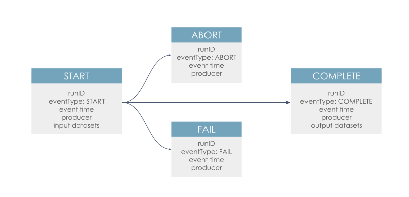

# The Run Cycle

The OpenLineage [object model](object-model.md) is event-based, and each event is called a Run State Update. These updates provide an OpenLineage backend with details about the activities of a Job.

The OpenLineage Run Cycle has several defined states that correspond to changes in the state of a pipeline task. When a task transitions between these - e.g. it is initiated, finishes, or fails - a Run State Update is sent that describes what happened.

Each Run State Update contains the run state (i.e., `START`) along with metadata about the Job, its current Run, and its input and output Datasets. It is common to add additional metadata throughout the lifecycle of the run as it becomes available.

## Run States

There are five run states currently defined in the OpenLineage [spec](https://openlineage.io/apidocs/openapi/):

* `START` to indicate the beginning of a Job

* `RUNNING` to provide additional information about a running Job

* `COMPLETE` to signify that execution of the Job has concluded

* `ABORT` to signify that the Job has been stopped abnormally

* `FAIL` to signify that the Job has failed

* `OTHER` to provide additional metadata outside of the standard run cycle - e.g., on a run that has already completed

## Typical Scenarios

A batch Job - e.g., an Airflow task or a dbt model - will typically be represented as a `START` event followed by a `COMPLETE` event. Occasionally, an `ABORT` or `FAIL` event will be sent when a job does not complete successfully.

A long-running Job - e.g., a microservice or a stream - will typically be represented by a `START` event followed by a series of `RUNNING` events that report changes in the run or emit performace metrics. Occasionally, a `COMPLETE`, `ABORT`, or `FAIL` event will occur, often followed by a `START` event as the job is reinitiated. 

